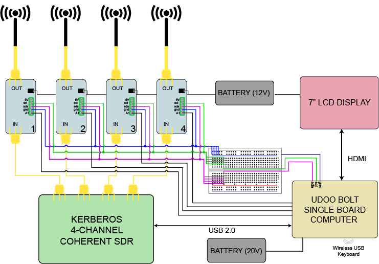
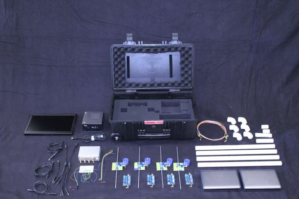

# 2021 IEEE APS/URSI Student Design Contest

This repository contains the Huff Research Group's submission to the [2021 APS Student Design Contest](https://www.ieeeaps.org/education/student-design-contest), Project Artemis. The goal of this project is to demonstrate a software-defined radio (SDR) phased array architecture that performs direction of arrival (DoA) and beamforming (BF). The system will be composed of the KerberosSDR, a 4-channel coherent radio, and use a modified version of the KerberosSDR demo software to perform MUSIC spectral estimation. The focus will be building an educational toolkit that can be utilized to teach beamforming and DoA, comparing analog and digital techniques as well as hybrid analog-digital architectures.

## Motivation and Application

Radio telemetry and direction-finding methods have enabled researchers, practitioners, and citizen scientists in agriculture and biological sciences for decades. These tools are commonly used in data collection on diverse animal populations, such as tracking migratory behavior and monitoring threatened species. Coalescing this data with geotags allows scientists to infer the health of the environment and habitats where these animals reside. Recently, such techniques have been deployed to track the invasive species, _Vespa mandarinia_ (Asian giant hornet) and _Lycorma delicatula_ (spotted lanternfly), and study their impact on native ecosystems. _V. mandarinia_ can rapidly destroy entire honey bee colonies, and _L. delicatula_ can cause huge economic damage to farming and lumber industries.

The goal of Project Artemis is to design and build an extensible invasive species tracking system that utilizes an antenna array with an SDR to perform real-time DoA. Additionally, we view Artemis as a low-cost approach that lowers-the-barrier-to-entry for educators and citizen scientists to engage in the growing fields of antennas, electromagnetics, signal processing, and arrays.

## System Architecture

Above is a top-level diagram of Project Artemis detailing the interconnection between various components. The system consists of an easy-to-use software applet built-upon the KerberosSDR  project as well as custom-built, reconfigurable hardware components such as the tunable antenna elements and phase-shifter boards for hybrid beamforming. Towards the intended goal of supporting field-tracking, we have included a small display for real-time visualization and have designed the entire system to be collapsible in a ruggedized suitcase.

 
This shows all of the components to Artemis layed out on a table. This GitHub repository contains all of our design files as well as the source code to Artemis, and the end of this report includes the Bill of Materials. The subsections that follow describe in detail the hardware and software components.

## Artemis Software

The Artemis Software toolkit is a forked version of the KerberosSDR example toolkit, tailored for the purpose of easing usage for end-users.

## Analog Components

Fill in with information on the analog design files.

## Jupyter Teaching Notebooks

Fill in description of Jupyter notebooks to teach array processing.

## References

