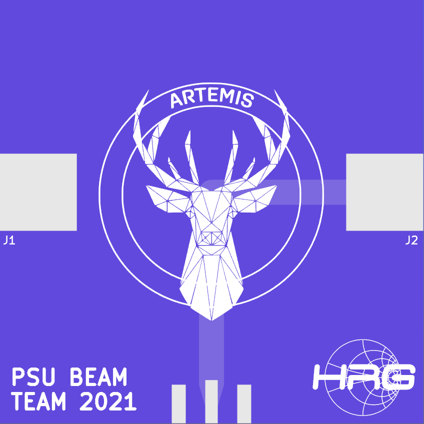

# Antenna Design

These are the production files for the antenna. J1 and J2 are each terminal
blocks which hold a conductor (eg. copper wire). When finally assembled, this
creates a dipole antenna.
