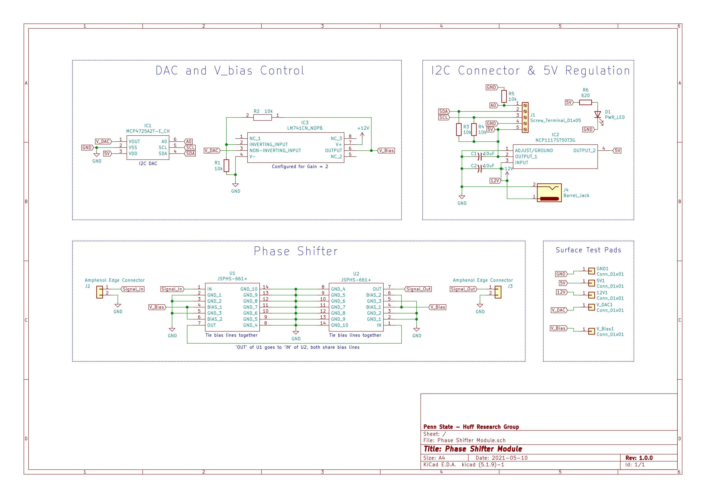

# Phase Shifter Modules

These modules are designed to be individually addressable fully contained phase
shifters with a full 360 degree range. This folder contains all design files.

## Schematic

## Bill of Materials

| Ref     | Value                   | Footprint                                                                       |
|---------|-------------------------|---------------------------------------------------------------------------------|
| 5V1     | Conn_01x01              | Phase Shifter Module:TestPad_Medium                                             |
| 12V1    | Conn_01x01              | Phase Shifter Module:TestPad_Medium                                             |
| C1      | 10uF                    | Capacitor_SMD:C_0805_2012Metric                                                 |
| C2      | 10uF                    | Capacitor_SMD:C_0805_2012Metric                                                 |
| D1      | PWR_LED                 | LED_SMD:LED_0805_2012Metric                                                     |
| GND1    | Conn_01x01              | Phase Shifter Module:TestPad_Medium                                             |
| IC1     | MCP4725A2T-E_CH         | Package_TO_SOT_SMD:SOT-23-6_Handsoldering                                       |
| IC2     | NCP1117ST50T3G          | NCP1117ST50T3G:SOT230P700X180-4N                                                |
| IC3     | LM741CN_NOPB            | Package_SO:SOP-8_3.9x4.9mm_P1.27mm                                              |
| J1      | Screw_Terminal_01x05    | TerminalBlock_TE-Connectivity:TerminalBlock_TE_282834-5_1x05_P2.54mm_Horizontal |
| J2      | Amphenol Edge Connector | Amphenol Edge:Amphenol_132255_Edge                                              |
| J3      | Amphenol Edge Connector | Amphenol Edge:Amphenol_132255_Edge                                              |
| J4      | Barrel_Jack             | Connector_BarrelJack:BarrelJack_CUI_PJ-063AH_Horizontal                         |
| R1      | 10k                     | Resistor_SMD:R_0805_2012Metric                                                  |
| R2      | 10k                     | Resistor_SMD:R_0805_2012Metric                                                  |
| R3      | 10k                     | Resistor_SMD:R_0805_2012Metric                                                  |
| R4      | 10k                     | Resistor_SMD:R_0805_2012Metric                                                  |
| R5      | 10k                     | Resistor_SMD:R_0805_2012Metric                                                  |
| R6      | 620                     | Resistor_SMD:R_0805_2012Metric                                                  |
| U1      | JSPHS-661+              | SamacSys_Parts:JSPHS661                                                         |
| U2      | JSPHS-661+              | SamacSys_Parts:JSPHS661                                                         |
| V_Bias1 | Conn_01x01              | Phase Shifter Module:TestPad_Medium                                             |
| V_DAC1  | Conn_01x01              | Phase Shifter Module:TestPad_Medium                                             |